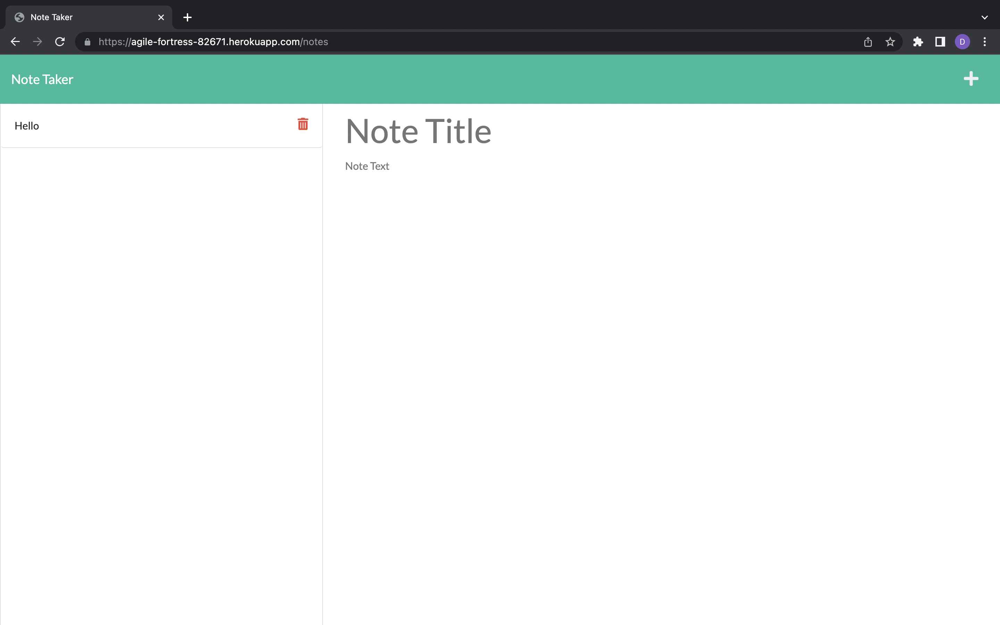

# Note Taker

  ## Description 
  In this project, the user will be able to create note titles and descriptions for those notes and be able to add it to the list and be able to remove notes from the list.

  ## Screenshots
  
  
  

  ## Installation
  Download all files from this repo. Make sure to have npm install. Make sure to have uuid install by typing in terminal 'npm install uuid'. If you want to deploy it on Heroku make sure to have Heroku installed.

  ## Usage
  If using Heroku make sure to have it installed and running. Then use the link you have created or in the terminal type 'heroku open'. Then you can click get started. Then you will be able to create notes, add them to the list on the left and be able to delete notes from the list. If you want to use node, you can type in terminal 'node server.js', then use the link given to open the application.

  ## Application Link
  Link for application: [Note Taker](https://agile-fortress-82671.herokuapp.com/)

  ## Questions
  GitHub Username: dcontrer83

  Link to GitHub profile: [dcontrer83 GitHub Profile](https://github.com/dcontrer83)

  Email Address: dcontrer83@yahoo.com

